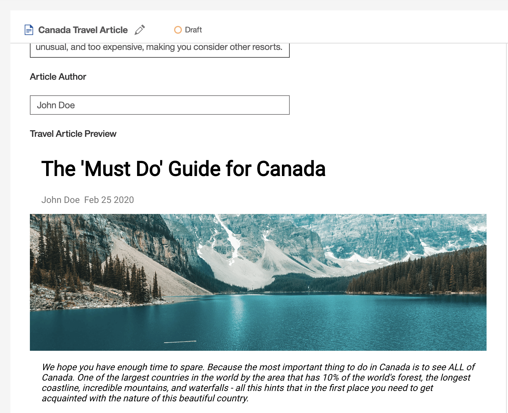

# Travel Article Preview UI Extension Sample

This sample extends the Authoring interface of Acoustic Content by adding a 'Travel Article Preview' feature. This custom UI extension renders a 'Travel Article' content item right in the authoring user interface. It gives content authors a preview of how an article will appear after it's published on a website.

This is a companion sample for sample-react-traveler-website, and it is highly recommended to install this preview sample into the same Acoustic Content tenant as that website sample, after installing the website sample.



## Installing the Sample

### Prerequisites

- Trial or Standard Tier of the Content Hub;

- [wchtools-cli](https://github.com/ibm-wch/wchtools-cli) v2.3.4 or above;

- The latest Node 10.x LTS version of Node;

- As mentioned above, it is highly recommended to install this sample after installing sample-react-traveler-website in the same tenant.

- Run `wchtools init` to setup the [WCH tools CLI](https://github.com/ibm-wch/wchtools-cli#getting-started);

- Download or clone this repository to get the 'Sample Travel Article Preview' artifacts.

### Deploy the sample into Acoustic Content

1. Change the tenant information, by changing the values in `src/api/endpoints.js`. All hub information containing domain, IDs and URLs for the hub can be found inside the Content Hub (Sidebar > About > Hub Information)

   ```
   export const DOMAIN_NAME = 'your-domain-name.com';
   export const CONTENT_HUB_ID = '0000000-0000-0000-0000-000000000000';
   ```

2. Change the tenant id in _homepage_ value inside `package.json` in the `sample-travel-article-preview` folder to the Domain Name with the Content Hub ID;

   ```
   "homepage": "/CONTENT_HUB_ID/dxauth/ui-extension-article-preview",
   ```

3. Install dependencies by running `npm install`;

4. Run `npm run init-content` command to deploy content types and items for this sample to the Content Hub;

5. Run `npm run hub-build-deploy` command to deploy the UI extension sample to the Content Hub;

6. Check inside your hub that 'Travel Article' items have 'Travel Article Preview' extension feature. Whenever you view or edit a Travel Article, you will see a preview at the bottom of the edit form where it says "Travel Article Preview".

### Debugging and testing

While making changes to the sample you can publish changes with `npm run hub-build-deploy` command.

If you want to develop another sample (with the use of this one) that requires more code/deploy/test cycles we recommend to do it locally:

- [Setup extension locally](https://github.com/acoustic-content-samples/sample-custom-element-ui#running-testing-and-debugging-custom-user-interface-extensions-locally)

- Inside `package.json` set `homepage` value with directory path wihout content hub id

  ```
    "homepage": "/dxauth/ui-extension-article-preview",
  ```

- Use `npm run hub-build` to update the sample with changes
